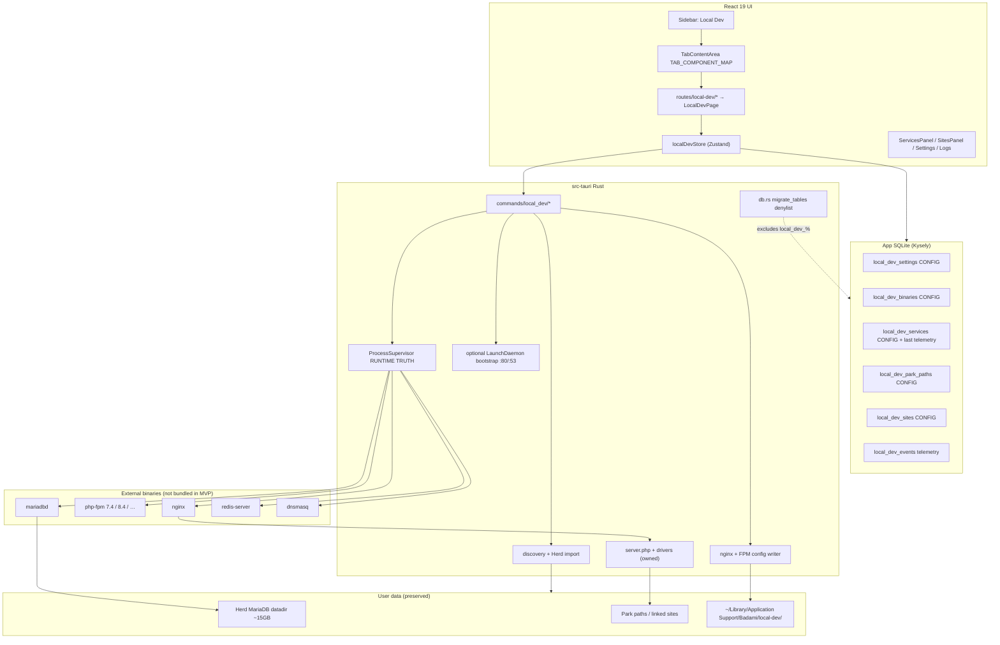
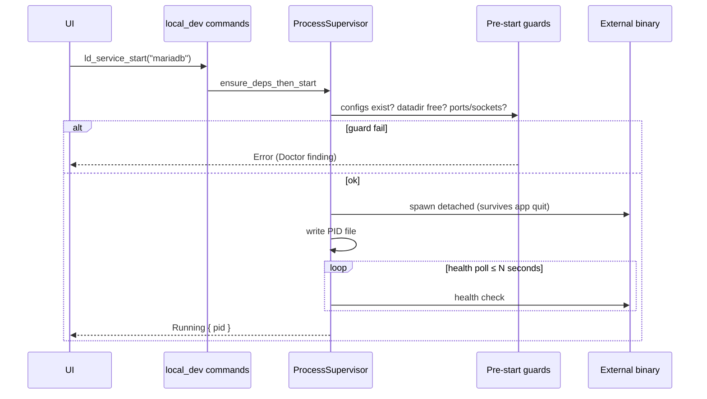
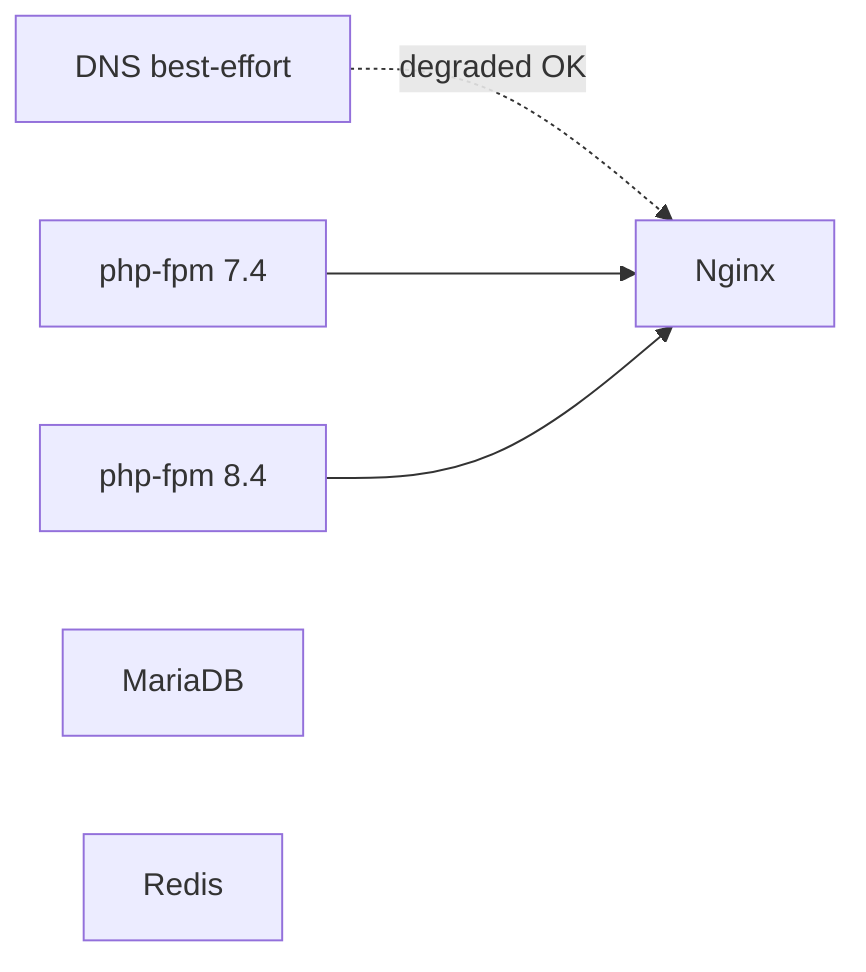
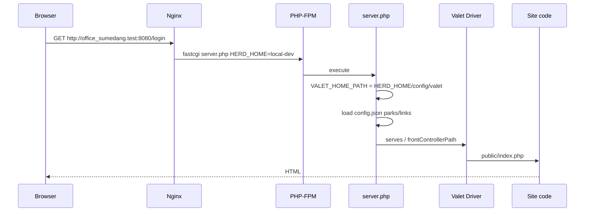
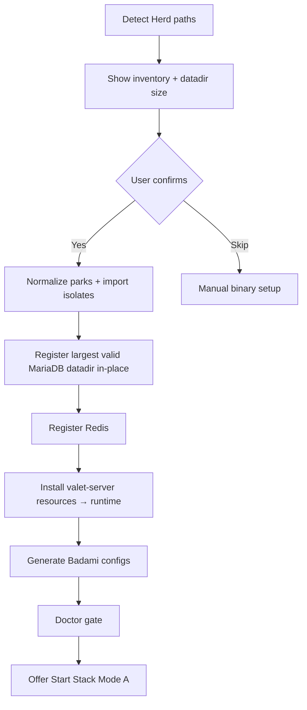

# Badami Local Dev — Design Document

| Field | Value |
| --- | --- |
| **Title** | Badami Local Dev (Laravel Herd replacement) |
| **Author** | TBD |
| **Date** | 2026-07-22 |
| **Status** | Implemented MVP Phase A (rev 3 design; docs PR 11 / v1.13.0) |
| **Target release** | v1.13.0 (MVP Phase A) |
| **Platform (MVP)** | macOS (Apple Silicon primary; Intel binary selection supported) |
| **Related modules** | Database Client, Projects, Servers (explicit non-overlap) |

---

## Overview

**Badami Local Dev** is a new menu module that replaces **Laravel Herd** for the user's local PHP development workflow on macOS. Herd's GUI is currently broken (cracked dylib `macked.app.dylib` segfault on macOS 27 beta), but **all data and binaries remain on disk**: ~15GB MariaDB data, PHP 7.4/8.4 FPM, nginx, dnsmasq, Redis, Valet park paths, and site isolation configs.

MVP adopts a **manager / orchestrator model**: Badami does **not** bundle PHP/nginx/MariaDB binaries. It discovers, configures, and start/stops external binaries (existing Herd leftovers first, then Homebrew / manual paths). This preserves the 15GB database and restores `*.test` sites with minimal risk.

Later phases may optionally download/bundle binaries (full Herd-like experience). That is documented as future work and is **not** required for productivity recovery.

---

## Background & Motivation

### Current state

The user depends on Herd for:

| Capability | How Herd provides it | On-disk status (2026-07-22) |
| --- | --- | --- |
| Nginx + `*.test` vhosts | Valet-style single `server.php` + per-isolated-site nginx confs | Binary: `/Applications/Herd.app/Contents/Resources/nginx-arm64`; configs under `~/Library/Application Support/Herd/config/nginx/` |
| PHP multi-version + FPM | `php74` / `php84` + FPM sockets `herd74.sock` / `herd84.sock` | Bins in `~/Library/Application Support/Herd/bin/`; FPM confs in `config/fpm/` (also **8.2 conf without binary**) |
| MariaDB | Managed service UUID data dir | **15GB** at `~/Library/Application Support/Herd/config/services/44A7D8F8-5755-4AF0-8E1D-88C85118F3ED/`; basedir `/Users/Shared/Herd/services/mariadb/10.11.6`; socket `/tmp/mariadb-44A7D8F8-….sock`; port **3306** |
| Redis | Managed service | `/Users/Shared/Herd/services/redis/7.4.7/`; `dump.rdb` in Herd bin |
| DNS `*.test` | dnsmasq + `/etc/resolver/test` | resolver still points to `127.0.0.1`; dnsmasq binary in Herd.app Resources |
| Park / link | Valet `config.json` | Parks: `…/valet/Sites` (duplicated w/ trailing slash), `~/Herd/`, **`~/Documents/Code/TugasNegara/php/`** |
| PHP isolation | Per-site nginx conf with `$herd_sock_74` etc. | e.g. `office.test` → `ISOLATED_PHP_VERSION=7.4` |
| Privileged ports | SMJobBless helper | **`/Library/PrivilegedHelperTools/de.beyondco.herd.helper`** + LaunchDaemon `de.beyondco.herd.helper` — **not** a Badami integration surface |

### Pain points

1. **Herd GUI unusable** on macOS 27 beta — cannot start/stop services or manage sites via Herd.
2. **Data is intact but stranded** — MariaDB clean-shutdown data (~15GB, multiple production-like local DBs: `office_oku`, `office`, `office_desa`, `dtsen`, …).
3. **No unified control plane** — user already uses Badami for remote servers, DB client, projects; local stack is a separate broken app.
4. **Risk of destructive "fixes"** — reinstalling Herd or running random scripts could wipe or corrupt the data dir.

### Why Badami

Badami already has:

- Tauri v2 process/command surface (`src-tauri/src/commands/`)
- Database Client (MySQL/MariaDB via sqlx) — natural integration once local MariaDB is up
- Projects module — optional project ↔ local site link
- SQLite app DB with migration pattern (`src/db/migrations/`, `initDatabase` in `src/db/client.ts`)
- Sidebar + app tabs (`Sidebar.tsx`, `appTabStore.ts`, **`TabContentArea.tsx` `TAB_COMPONENT_MAP`**)
- Shell open / path helpers (`src/lib/osOpen.ts`)

Local Dev completes the "local + remote" developer loop without leaving Badami.

---

## Goals & Non-Goals

### Goals (MVP — Phase A)

1. **Discover & import** existing Herd installation (binaries, configs, parks, sites, MariaDB data dir, Redis) without copying the 15GB data dir by default.
2. **Process supervisor** for nginx, php-fpm (multi-version), MariaDB/MySQL, Redis, dnsmasq: start / stop / restart / health / logs.
3. **Site management**: list sites from park paths + links; open in browser; set PHP version isolation; park/link/unpark/unlink.
4. **Valet-style routing** via owned `server.php` + drivers (not dependency on Herd.app remaining installed forever).
5. **HTTP dual-mode**: unprivileged `:8080` works immediately; optional one-time Badami LaunchDaemon for `:80` (see Key Decision 15).
6. **DNS modes for `*.test`**: adopt existing :53 listener, or Mode B-lite (dnsmasq LaunchDaemon only), or one-time high-port resolver rewrite — **resolver file alone is not healthy DNS** (Key Decision 23).
7. **Auto-register** local MariaDB as a Badami Database connection after service is healthy (keychain-aware).
8. **Clear UX separation** from remote **Servers** module.
9. **Hard safety rules**: never delete/move Herd data dir unless user explicitly confirms a labeled destructive action; **hard-fail double MariaDB open** on same datadir.
10. **Turso sync exclusion** for all `local_dev_%` tables so machine paths never replicate.

### Non-Goals (MVP)

- Bundling PHP/nginx/MariaDB/Redis binaries inside Badami.
- Windows / Linux local stack (stub UI only: "macOS only for now").
- Full Herd Pro feature parity: MinIO, Mailpit/SMTP dump UI, Node version manager, share tunnels, dump server GUI.
- Automatic migration of cracked/pirated Herd license or reverse-engineering Herd Pro.
- **Reusing or calling Herd's privileged helper** (`de.beyondco.herd.helper`) — unsupported, fragile.
- Replacing Postgres.app (note coexistence only).
- Running as a system daemon for **all** services by default (only optional nginx/dnsmasq privileged unit for low ports).
- TLS / `*.test` HTTPS certificates (Phase B optional).
- Docker / Sail / DDEV integration.
- Caddy/Traefik as reverse proxy (out of scope; nginx only).

### Later phases (documented, not MVP)

| Phase | Scope |
| --- | --- |
| **B** | TLS (mkcert-style), live log subscribe, optional full-stack launchd autostart, site-level env overrides |
| **C** | Optional binary download/bundle (versioned PHP/nginx/MariaDB), first-run without Herd leftovers |
| **D** | Windows/Linux ports or explicit permanent non-support |

---

## Proposed Design

### High-level architecture



### Component layers

| Layer | Responsibility | Location |
| --- | --- | --- |
| UI | Service toggles, site list, import wizard, logs, settings | `src/routes/local-dev/`, `src/components/local-dev/` |
| Tab shell | Keepalive rendering | `TabContentArea.tsx` + `appTabStore.ts` + `Sidebar.tsx` |
| Store | Service state polling, site cache, settings | `src/stores/localDevStore.ts` |
| Queries | CRUD for local-dev **config** tables | `src/db/queries/localDev.ts` |
| Tauri commands | All process/config I/O | `src-tauri/src/commands/local_dev/` |
| Supervisor | Spawn, PID files, health, restart policy — **runtime truth** | Rust `process_supervisor` |
| Config runtime | Generated nginx/fpm/dnsmasq under Badami app support | `~/Library/Application Support/Badami/local-dev/` |
| Router PHP | Valet-compatible front controller + drivers | Bundled via `tauri.conf.json` `bundle.resources` → installed under runtime |

### Runtime config layout (Badami-owned)

All **generated** configs live under Badami's application support directory so Herd originals remain read-only sources.

**Critical Valet contract:** stock Herd/Valet `server.php` does:

```php
define('VALET_HOME_PATH', $_SERVER['HERD_HOME'].'/config/valet');
// loads VALET_HOME_PATH.'/config.json'
// require_once './cli/includes/require-drivers.php'  (relative to server.php)
```

Therefore Badami layout **mirrors Herd's home shape** so an unpatched (or minimally patched) router works when nginx sets `fastcgi_param HERD_HOME`:

```
~/Library/Application Support/Badami/local-dev/          ← HERD_HOME for fastcgi
├── config/
│   └── valet/                                           ← VALET_HOME_PATH
│       ├── config.json                                  # tld, paths[], loopback
│       ├── Sites/                                       # optional link symlinks
│       └── Certificates/                                # Phase B
├── nginx/
│   ├── nginx.conf
│   ├── badami.conf                                      # default server → server.php
│   └── sites/                                           # isolated PHP version server blocks
├── fpm/
│   ├── 7.4-fpm.conf
│   └── 8.4-fpm.conf
├── socks/
│   ├── php74.sock
│   └── php84.sock
├── dnsmasq/
│   └── dnsmasq.conf
├── mariadb/
│   └── my.cnf                                           # WRAPPER only — datadir still Herd
├── valet-server/                                        # SCRIPT DIR for server.php (not HERD_HOME)
│   ├── server.php                                       # entry (may be thin wrapper)
│   ├── cli/                                             # full Valet driver tree (MIT)
│   │   ├── includes/require-drivers.php
│   │   └── Valet/...
│   ├── Drivers/                                         # if needed by vendor layout
│   └── vendor/                                          # if required by vendored Valet
├── pids/
│   ├── nginx.pid
│   ├── php74-fpm.pid
│   ├── php84-fpm.pid
│   ├── mariadb.pid
│   ├── redis.pid
│   └── dnsmasq.pid
├── logs/
│   ├── nginx-error.log
│   ├── php-fpm-74.log
│   ├── php-fpm-84.log
│   ├── mariadb.log
│   ├── redis.log
│   └── dnsmasq.log
└── import/
    └── herd-snapshot.json
```

**`HERD_HOME` vs script directory:**

| Concept | Path | Purpose |
| --- | --- | --- |
| `HERD_HOME` (fastcgi param) | `…/Badami/local-dev` | `config/valet/config.json` resolution |
| `SCRIPT_FILENAME` / server root | `…/Badami/local-dev/valet-server/server.php` | entry script path for FPM |
| FPM `chdir` (pool) | same `valet-server/` directory | makes cwd-relative `./cli/…` resolves (see Key Decision 24) |

### `server.php` cwd contract under php-fpm (Key Decision 24)

Stock Herd/Valet `server.php` uses **cwd-relative** requires:

```php
require_once './cli/includes/require-drivers.php';
require_once './cli/Valet/Server.php';
```

Under php-fpm the process cwd is often `/` (or the pool default), **not** the script directory — so `./cli/…` breaks even when `SCRIPT_FILENAME` is absolute.

**Mandatory (both layers; belt-and-suspenders):**

1. **FPM pool `chdir`** — every Badami-generated pool conf must set:
   ```ini
   chdir = {BADAMI_LOCAL_DEV_HOME}/valet-server
   ```
2. **Patch vendored body** — when copying stock server into `_valet_server.php` (or equivalent), rewrite requires to `__DIR__`-based paths:
   ```php
   require_once __DIR__ . '/cli/includes/require-drivers.php';
   require_once __DIR__ . '/cli/Valet/Server.php';
   ```
   Do **not** ship an unpatched `./cli/…` body as the only strategy.

Thin outer wrapper (still required for `HERD_HOME` default):

```php
<?php
// Badami Local Dev front controller wrapper
if (empty($_SERVER['HERD_HOME'])) {
    $_SERVER['HERD_HOME'] = dirname(__DIR__); // local-dev root
}
require __DIR__ . '/_valet_server.php'; // patched body with __DIR__ requires
```

**PR 3 vendoring checklist:** apply `__DIR__` patch + generate `chdir` in all FPM pool templates. **Smoke test:** one FPM request that loads drivers without 500 (integration on dev machine).

**No njs dependency in MVP configs.** Herd Pro may inject njs maps for `$herd_sock*`; Badami generates **static** `fastcgi_pass unix:…` only (see Site Model).

**MariaDB datadir rule:** Wrapper `my.cnf` **reuses** existing Herd path by default. Generators never rewrite `datadir`/`basedir` without an explicit advanced migration flow.

---

## Process Supervisor Design

### Model

Each managed unit is a `ManagedService`:

```rust
pub enum ServiceKind {
    Nginx,
    PhpFpm { version: String }, // "7.4", "8.4"
    MariaDb,
    MySql,
    Redis,
    DnsMasq,
}

pub enum ServiceStatus {
    Stopped,
    Starting,
    Running { pid: u32 },
    Unhealthy { pid: Option<u32>, reason: String },
    Stopping,
    Error { message: String },
}

pub struct ServiceSpec {
    pub kind: ServiceKind,
    pub id: String,                 // stable id e.g. "php-fpm-8.4"
    pub binary_path: PathBuf,
    pub args: Vec<String>,
    pub pid_file: PathBuf,
    pub log_file: PathBuf,
    pub working_dir: Option<PathBuf>,
    pub env: Vec<(String, String)>,
    pub health: HealthCheck,
    pub auto_restart: bool,
    pub depends_on: Vec<String>,
    /// If true, refuse start unless required config files exist on disk.
    pub requires_config: Vec<PathBuf>,
}

pub enum HealthCheck {
    PidAlive,
    Tcp { host: String, port: u16 },
    UnixSocket { path: PathBuf },
    Http { url: String, expect_status: u16 },
    Composite(Vec<HealthCheck>),
}
```

### Source of truth: runtime vs SQLite

| Concern | Source of truth | SQLite role |
| --- | --- | --- |
| Is service running now? | **`LocalDevState` supervisor memory** (polled health) | Optional `last_status` / `last_error` / `last_started_at` **telemetry** written at most on transition (not every poll) |
| Binary path, ports, datadir, enabled | SQLite `local_dev_*` **config** | Authoritative config |
| Start path dependencies | Supervisor + filesystem configs | Start **must not require** SQLite write lock (sync-safe): read config once into memory; proceed even if later telemetry write fails |

**Rule:** Start/stop logic never blocks on sync. Config fields (`binary_id`, `config_path`, `data_dir`, `enabled`, `auto_start`) are config; `last_status` is ephemeral telemetry.

### Lifecycle



### Process API (corrected)

- Use **`tokio::process::Command`** with **`kill_on_drop(false)`** so dropping the child handle does **not** kill services when Badami exits.
- Immediately after spawn, **detach intent**: do not keep the child as a kill-on-exit dependency of the app process group.
- On Unix, spawn with a new session where appropriate (`pre_exec` + `setsid`) for user-owned services (php-fpm, redis, mariadb, unprivileged nginx) so they are not SIGHUP'd when the GUI quits.
- **Do not** use shell strings; only `Command::new(binary).args([...])`.
- Short-lived tools (`mysqladmin`, `nginx -s reload`, `nginx -t`) may use `std::process::Command` or tokio; they are waited.

### Services survive app exit

**Decision:** Stack **intentionally outlives** Badami (Herd model). Closing/quitting Badami does **not** stop nginx/php-fpm/MariaDB/Redis/dnsmasq.

| Service class | Survival mechanism |
| --- | --- |
| User-owned (MariaDB, Redis, php-fpm, nginx in Mode A :8080) | `kill_on_drop(false)` + `setsid`; PID files under runtime `pids/` |
| Privileged nginx/dnsmasq (Mode B :80/:53) | **launchd** unit owns process; Badami talks via `launchctl` load/unload/kickstart |

On Badami next launch, supervisor **adopts** running processes (see adoption).

### Start / stop / restart

| Action | Behavior |
| --- | --- |
| **Start** | Verify `requires_config` files exist → topologically sort deps → pre-start guards → spawn → PID file → health |
| **Stop** | SIGTERM (or `nginx -s quit` / `mysqladmin shutdown`) → grace → escalate carefully |
| **Restart** | Stop then Start; nginx conf-only changes prefer `nginx -s reload` / launchctl kickstart |
| **Start all** | Order: **DNS (best-effort)** → MariaDB → Redis → php-fpm (needed versions) → nginx. DNS failure **does not** abort the rest of the stack (see DNS modes). |
| **Stop all** | Reverse: nginx → php-fpm → Redis → MariaDB → dnsmasq (only if Badami-owned; never kill foreign adopted DNS without confirm) |

**MariaDB start is disabled** until wrapper `my.cnf` exists and `ld_doctor` MariaDB checks pass (`ready_for_mariadb_start: true`).

### Stop signals (MariaDB special)

1. Prefer `mariadb-admin` / `mysqladmin --defaults-file=… --socket=… shutdown` (binaries from basedir: `/Users/Shared/Herd/services/mariadb/10.11.6/bin/`).
2. Grace period **60s** default.
3. SIGTERM to PID if admin fails.
4. **SIGKILL only after** admin + SIGTERM both fail and user confirms in UI (or after extended grace with explicit log warning). Never auto-SIGKILL on crash-recovery loops.

### PID adoption (macOS)

1. Read PID file; if missing, scan listeners on expected port/socket.
2. Resolve binary via `proc_pidpath(pid)` (libproc) — must match configured binary **realpath**.
3. Confirm expected listen: TCP port or Unix socket inode.
4. If match → adopt `Running { pid }`.
5. If PID file stale → delete, mark `Stopped`.
6. Settings: `adopt_existing_processes` default `true`.

### Health checks (defaults)

| Service | Health |
| --- | --- |
| nginx Mode A | PID + TCP `127.0.0.1:8080` |
| nginx Mode B | PID + TCP `127.0.0.1:80` (or launchd state) |
| php-fpm | PID + Unix socket connectable |
| MariaDB | Prefer socket connect + optional `SELECT 1`; else TCP 3306 |
| Redis | PID + TCP (default 6379) |
| DNS | **Healthy** only if a probe resolves `{random}.test` → `127.0.0.1` (or configured loopback). Resolver **file existence alone is not enough**. Adopted :53 PID optional metadata. |

### Crash recovery

- `auto_restart: true` for nginx, php-fpm, dnsmasq (max 5 / 5 min → `Unhealthy`).
- MariaDB: **`auto_restart: false`** — toast + `local_dev_events` + notification.
- Emit via `tauri-plugin-notification`.

### Log tails & growth

- `ld_log_tail(service_id, lines)` — last N lines, max read **512 KiB**.
- **Log rotation policy:** if log file **> 50 MiB**, supervisor (or doctor "Repair logs") renames to `.1` and truncates; keep at most 2 rotated files per service. Doctor warns if `logs/` total **> 500 MiB**.
- Phase B: event-stream live tail.

### Concurrency

- `LocalDevState` in Tauri `.manage()` with `tokio::sync::Mutex`.
- Start/stop serialized per service id; global lock for stack operations.

---

## MariaDB double-open / datadir protection (critical)

Target datadir (example):  
`~/Library/Application Support/Herd/config/services/44A7D8F8-5755-4AF0-8E1D-88C85118F3ED/`

**Two `mariadbd` processes on one datadir can corrupt InnoDB.** Hard guards:

### Pre-start checklist (`ld_service_start("mariadb")`)

1. **Config gate:** Badami wrapper `mariadb/my.cnf` exists; `datadir`/`basedir`/`socket` parsed; `datadir` equals configured service `data_dir` (canonicalized). Refuse if missing.
2. **Never** run `mysql_install_db` / `mariadb-install-db` against non-empty datadir.
3. **Socket probe:** If configured socket path exists and accepting connections → attempt `SELECT 1` via admin client → if success → **adopt only**, do **not** spawn second process.
4. **TCP probe:** If `127.0.0.1:3306` accepts connections → same adopt-or-fail (do not spawn).
5. **Foreign process / lock:** If socket or port is held by PID whose `proc_pidpath` is a mysqld/mariadbd **not** adopted (or datadir lock indicates live instance) → **`Error`** with Doctor finding: *"MariaDB datadir already in use by PID … — stop that instance or adopt it."* **Hard-fail start.**
6. **Lock-file heuristics:** If `*.pid` inside datadir points to live foreign mysqld → hard-fail. If pid file stale, remove only the **pid file**, never data files.
7. **Binary resolution:** Prefer  
   - `/Users/Shared/Herd/services/mariadb/10.11.6/bin/mariadbd`  
   - Herd `bin/mariadbd` / `bin/mysqld` symlinks  
   Admin: `mariadb-admin` or `mysqladmin` from same basedir `bin/`.
8. **Spawn:** `mariadbd --defaults-file=<badami-wrapper-my.cnf>` only after all checks pass.

### Wrapper my.cnf rules

- May set `log-error` to Badami `logs/mariadb.log`.
- May set `port=3306` explicitly.
- **Must not** change `datadir` or `basedir` without advanced clone flow.
- Generators use **discovered paths only** — never hardcode `/Users/khalid/...` or username `khalid`.

### Acceptance test

- Simulate second start while first running → error, **zero** datadir file deletions; row-count spot-check unchanged.

---

## Service Model

### nginx

- **Binary discovery:** configured path → Herd `nginx-arm64` / `nginx-x86` (by arch) → Homebrew → `which nginx`.
- **Config:** Badami-generated `nginx.conf` includes `sites/*.conf` + `badami.conf` default server.
- **No njs** includes or `$herd_sock` maps.
- **User directive:** only when master runs as root (Mode B). Value from **runtime** username + primary group (`users` crate or `id -un`/`id -gn` once at generate time) — **not** hardcoded.
- **HTTP modes:** see Privilege section.

### php-fpm (multi-version)

- Discover versions only when **both** binary and generatable pool conf exist.
- Live machine: **7.4** and **8.4** have bins; **8.2** has FPM conf in Herd but **no** `php82-fpm` in `Herd/bin` → discovery marks 8.2 **unavailable**; isolation UI **must not** offer it.
- Badami sockets: `…/local-dev/socks/php74.sock`, `php84.sock` (not Herd's `herd74.sock` unless adopting Herd fpm — prefer Badami-owned pools for path control).
- Every generated pool conf **must** include `chdir = {BADAMI_LOCAL_DEV_HOME}/valet-server` (KD24).
- Isolation confs use **static** `fastcgi_pass unix:/full/path/to/php74.sock;` — no variable maps.

### MariaDB / MySQL

- Prefer existing Herd instance (largest valid UUID datadir — see Import).
- Binary: basedir `bin/mariadbd`.
- Safety: full pre-start checklist above.

### Redis

- Binary + dump path from import; preserve `dump.rdb` when possible.

### dnsmasq / DNS for `*.test`

See full **DNS modes** under Privilege section. Summary:

- Unprivileged processes **cannot** bind UDP/TCP **53** on macOS.
- `/etc/resolver/{tld}` pointing at `127.0.0.1` is **necessary but not sufficient** — something must answer DNS on the port the resolver uses.
- Badami-owned dnsmasq config: `address=/.{tld}/127.0.0.1` (and `listen-address=127.0.0.1`, port per DNS mode).

### Service dependency graph



Nginx does **not** hard-depend on Badami-started dnsmasq; site **Open** does depend on DNS health (Doctor gate).

---

## Site Model

### Concepts (Valet-compatible)

| Concept | Definition |
| --- | --- |
| **Park path** | Parent directory; each immediate child folder is `{folder}.{tld}` |
| **Link** | Symlink/record mapping hostname → project path |
| **Isolation** | Site-specific PHP-FPM via static `fastcgi_pass` in `nginx/sites/{name}.conf` |
| **Secure** | HTTPS (Phase B) |
| **Open** | `shell.open(url)` — URL includes port if Mode A (`http://name.test:8080`) |

### PHP isolation

- On isolate: write site conf with `server_name` + **static** unix socket for that version; comment `# ISOLATED_PHP_VERSION=7.4` for re-import parity.
- Isolation dropdown = **intersection** of (discovered FPM binaries with valid pool conf).
- Missing binary → conf generation **refused**.
- Unisolate: delete site conf; default server uses default PHP socket.
- Reload nginx after conf change (`nginx -s reload` or launchctl).

### Site URL builder

```ts
function siteUrl(name: string, tld: string, httpPort: number): string {
  const host = `${name}.${tld}`;
  if (httpPort === 80) return `http://${host}`;
  return `http://${host}:${httpPort}`;
}
```

---

## Request Routing Decision

### Decision: **Valet-style central `server.php` + drivers** (primary)

**Rationale:** Matches Herd/Valet; parks need no per-site conf unless isolation; drivers solve front controllers.

**Not primary:** pure per-site nginx for every parked folder.

### Vendoring requirements

Ship under `src-tauri/resources/local-dev/valet-server/` (copied to runtime on first use):

- `server.php` wrapper + `_valet_server.php` body with **`__DIR__`-based requires** (not bare `./cli/…`)
- Entire `cli/` tree needed by `require-drivers.php` + `Valet\Server` + `Valet\Drivers\*`
- Any `vendor/` autoload if the shipped Valet tree needs it
- **MIT attribution** file `THIRD_PARTY_VALET.md`
- FPM pool templates with **`chdir = {valet-server}`** (Key Decision 24)

`tauri.conf.json`:

```json
"bundle": {
  "resources": [
    "resources/local-dev/**/*"
  ]
}
```

(Currently **no** `bundle.resources` — this PR is required.)

### Sample nginx snippets (MVP)

**Default server (`badami.conf`) — Mode A port 8080:**

```nginx
server {
    listen 127.0.0.1:8080 default_server;
    root /;
    charset utf-8;
    client_max_body_size 64M;

    location / {
        rewrite ^ "{VALET_SERVER_PHP}" last;
    }

    location ~ [^/]\.php(/|$) {
        fastcgi_split_path_info ^(.+\.php)(/.+)$;
        fastcgi_pass unix:{DEFAULT_PHP_SOCK};
        include fastcgi_params;
        fastcgi_param SCRIPT_FILENAME "{VALET_SERVER_PHP}";
        fastcgi_param HERD_HOME "{BADAMI_LOCAL_DEV_HOME}";
        fastcgi_param PATH_INFO $fastcgi_path_info;
    }
}
```

**Isolated site (static socket, no njs):**

```nginx
# ISOLATED_PHP_VERSION=7.4
server {
    listen 127.0.0.1:8080;
    server_name office.test www.office.test *.office.test;
    # ... same locations ...
    location ~ [^/]\.php(/|$) {
        fastcgi_pass unix:{BADAMI_LOCAL_DEV_HOME}/socks/php74.sock;
        # ... HERD_HOME + SCRIPT_FILENAME as above ...
    }
}
```

Mode B: same conf with `listen 127.0.0.1:80` and optional `user "{username}" {group};` in main `nginx.conf` when master is root.



---

## Binary Discovery & Path Configuration

### Discovery pipeline (`ld_discover`)

1. **Herd known paths** (highest priority)
2. **Homebrew** (`/opt/homebrew` arm64, `/usr/local` intel)
3. **PATH**
4. **Manual** `local_dev_binaries`

### PHP-FPM version eligibility

For each candidate version `V`:

- Binary exists and `--version` parses
- Can write pool conf listening on Badami sock
- Else mark `available: false` with reason (`missing_binary`, `missing_conf_template`)

### MariaDB datadir candidates

Services dir may contain **multiple UUIDs** (live machine: `44A7D8F8-…` ~15G, others empty/tiny). Score by:

1. Directory size
2. Presence of `mysql/` system schema (or `ibdata1` + non-empty)
3. Valid readable `my.cnf` if present

Select highest score as default import target.

### Arch selection

```rust
fn preferred_suffix() -> &'static str {
    if cfg!(target_arch = "aarch64") { "arm64" } else { "x86" }
}
```

### Path generators

All templates use:

- `std::env::var("HOME")` / dirs crate for Application Support
- Runtime username/group for nginx `user` directive
- Canonicalized discovered paths only

Machine-specific absolute paths appear **only** in Appendix A as examples.

---

## Migration / Import from Herd

### Import wizard



### Path normalization

- `canonicalize` when path exists
- Strip trailing `/` before UNIQUE insert
- Dedupe park list (live `config.json` duplicates Sites with/without slash)

### Import actions

| Source | Action |
| --- | --- |
| `config/valet/config.json` | Parks/tld/loopback → `config/valet/config.json` + DB |
| `config/valet/Nginx/*.test` | Parse isolate version; **skip** if FPM version unavailable |
| UUID services | Score-pick MariaDB datadir |
| FPM confs | Template only for versions with binaries |
| Certificates | Note for Phase B |

### What is NOT done

- No deletion of Herd app/data
- No default 15GB copy
- No `DROP DATABASE`
- No overwrite of Herd configs in place
- **No call into `de.beyondco.herd.helper`**

### Herd process collision on import

**Decision (Open Q #2 resolved):** Import **does not** automatically kill Herd processes. Doctor lists conflicts; UI offers **"Stop conflicting processes"** only after explicit confirm. Prefer adopt if datadir already served.

### Safety copy (optional advanced)

Off by default; requires free disk ≥ size + 20%; rsync with progress.

---

## Privilege, HTTP port & DNS model (definitive)

### Reality check — HTTP

Herd binds `127.0.0.1:80` with nginx master as root (`user "{user}" staff;`) via **persistent** privileged helper:

- `/Library/PrivilegedHelperTools/de.beyondco.herd.helper`
- LaunchDaemon `de.beyondco.herd.helper`

Strategy “one-time osascript write resolver” alone does **not** keep port 80 working without a long-lived privileged nginx parent. “No continuous root” cannot mean “nginx master always unprivileged on :80.”

### Reality check — DNS (Mode A blocker)

MVP acceptance URL is **`http://office_sumedang.test:8080`**, which needs **both**:

1. nginx listening on `127.0.0.1:8080` (unprivileged — OK), and  
2. **Hostname resolution** of `office_sumedang.test` → `127.0.0.1`.

On this machine `/etc/resolver/test` contains `nameserver 127.0.0.1` (default DNS port **53**). Unprivileged processes **cannot bind :53**.  

**Resolver file presence ≠ working DNS.** If nothing answers on `127.0.0.1:53`, `*.test` fails even when nginx is healthy. Mode A “zero root for nginx” therefore still needs a **DNS strategy** (Key Decision 23).

### Decision: Dual-mode HTTP (Key Decision 15)

| Mode | When | nginx bind | Process owner | Site URLs |
| --- | --- | --- | --- | --- |
| **A — Unprivileged (default)** | Always available; nginx needs zero root | `127.0.0.1:8080` | User (`setsid`) | `http://{site}.test:8080` |
| **B — Privileged port 80 (optional)** | After one-time bootstrap | `127.0.0.1:80` | **Badami LaunchDaemon** (root master, workers drop to user) | `http://{site}.test` |

### Decision: DNS modes (Key Decision 23)

Ordered preference for making `*.{tld}` resolve to loopback:

| DNS mode | Privilege | Behavior | When used |
| --- | --- | --- | --- |
| **D0 — Adopt** | None | Detect existing listener on `127.0.0.1:53` (Herd dnsmasq, etc.) that correctly answers `*.test`; **do not spawn** a second dnsmasq. Mark DNS service `Running (adopted)`. | Preferred when present (common after Herd install). |
| **D1 — Mode B-lite** | One-time admin for LaunchDaemon | Install Badami LaunchDaemon for **dnsmasq only** on `127.0.0.1:53` with Badami conf; **nginx stays Mode A :8080**. Covers hostname URLs without privileged nginx. | When D0 unavailable; primary bootstrap path for MVP hostname URLs. |
| **D2 — High-port resolver** | One-time admin for `/etc/resolver/{tld}` only | Write resolver to use non-53 port (macOS `resolver(5)` supports a `port` directive, e.g. `nameserver 127.0.0.1` + `port 53535`), run **unprivileged** dnsmasq on that port. | Alternative if user refuses a long-lived root dnsmasq unit. |
| **D3 — Degraded** | None | No working DNS. Stack still starts MariaDB/php/nginx. Doctor marks DNS **unhealthy**. **Open site** blocked with actionable fix. Fallback URL display may show `http://127.0.0.1:8080` with `Host` header tip (advanced only — not primary UX). | Temporary until user completes D1/D2. |

**Explicitly invalid:** treating “`/etc/resolver/test` exists” as DNS healthy without a successful resolve probe.

#### DNS health probe (`ld_doctor` / `ld_service_status`)

```
resolve random-label.{tld}  →  expect 127.0.0.1 (or configured loopback)
```

Optional: connect UDP/TCP to configured DNS port. Fail closed for “Open site.”

#### Start stack behavior with DNS

1. Attempt D0 adopt.
2. If not healthy and Badami D1 unit installed → start/kickstart Badami dnsmasq.
3. If still not healthy → set DNS status `Unhealthy` / degraded; **continue** MariaDB → Redis → php-fpm → nginx.
4. UI banner: “Sites by hostname won’t open until DNS is fixed” + buttons: **Install DNS (Mode B-lite)** / **Use high-port resolver** / **Retry probe**.
5. Do **not** fail entire Start stack because :53 bind failed.

#### Bootstrap Mode B (HTTP :80) vs B-lite (DNS :53)

| Bootstrap package | Installs | Resulting UX |
| --- | --- | --- |
| **DNS only (B-lite, recommended first)** | LaunchDaemon `…local-dev.dnsmasq` only | `http://site.test:8080` works |
| **Full Mode B** | dnsmasq unit (if needed) + nginx unit on :80 | `http://site.test` works |
| **High-port DNS (D2)** | One-time resolver rewrite; user dnsmasq on 53535 | `http://site.test:8080` works; no long-lived root DNS if unit not used |

**Bootstrap Mode B HTTP (optional, after DNS healthy):**

1. Write LaunchDaemon for nginx with Badami `-c` config (`listen 127.0.0.1:80`).
2. Set `http_port=80`, `http_mode=privileged_launchd`.
3. Control via `launchctl` without re-auth.

**Explicit non-goals for privileges:**

- Do **not** reuse Herd's SMJobBless helper (unsupported IPC, foreign lifecycle).
- Do **not** claim “no process ever runs as root” when D1/Mode B units are installed — root is scoped to those units.
- User-owned services (MariaDB, Redis, php-fpm, nginx Mode A) **never** need root.
- Do **not** hardcode `/etc/hosts` lines for every parked site as the primary strategy (does not scale for park trees; optional emergency Doctor tip only).

**Alternative (documented, not default):** one-time `pf` rdr `80 → 8080` — still needs root once; Mode B nginx preferred for portless HTTP.

**Acceptance criteria (precise):**

| Criterion | Requirement |
| --- | --- |
| **MVP must — data plane** | MariaDB (adopt or start) + Redis + php-fpm + nginx Mode A up; `http://127.0.0.1:8080` with valid `Host: office_sumedang.test` returns app HTML (proves router without DNS). |
| **MVP must — hostname URL** | `http://office_sumedang.test:8080` works after DNS is healthy via **D0 adopt or D1 B-lite or D2**. Doctor must report DNS healthy before claiming this. First-run import on this machine should detect D0 if Herd dnsmasq still answers; otherwise prompt B-lite. |
| **MVP should** | Full Mode B portless `http://office_sumedang.test`. |

Open Question #1 (HTTP) and residual DNS gap are **closed** by this section.

---

## Integration with Database Module

### Password model (verified)

- `db_connections` has **no password column** (`017_db_client_module.sql`).
- Passwords use OS keychain: `save_db_password` / `get_db_password` / `delete_db_password` in `credential.rs`.
- sqlx URL builder already supports empty password (`unwrap_or("")`).

### Registration flow (prefer frontend)

After MariaDB health = Running:

1. **Probe auth (Open Q #4 closed):** TCP `127.0.0.1:3306` as `root` with **empty** password (`SELECT 1`). If fail, prompt user for password in UI (do not invent).
2. **Upsert connection in TypeScript** via existing `createConnection` / `updateConnection` in `src/db/queries/dbClient.ts` (reuse patterns; avoid parallel SQL in Rust).
3. Stable identity:
   - Lookup by fixed name `"Local MariaDB (Badami)"` **or** fixed id constant `LOCAL_DEV_MARIADB_CONNECTION_ID` stored in `local_dev_settings`.
4. Fields:

```ts
{
  name: "Local MariaDB (Badami)",
  engine: "mariadb",
  host: "127.0.0.1",
  port: 3306,
  username: "root",
  database_name: null, // browse all
  color: "#10b981",
}
```

5. If probe used non-empty password → `invoke("save_db_password", { connectionId, password })`. If empty → **do not** call `save_db_password` (leave keychain empty).
6. Do not force-connect workspace; only ensure card exists.
7. Optional thin Rust helper `ld_probe_mariadb_auth` returns `{ ok, needs_password }` only — registration stays in TS.

---

## Integration with Projects

Optional `local_dev_sites.project_id` → `projects.id`.

- Site row: "Link to Project"
- Project detail: `ProjectSitePanel` (Open URL, PHP version) — depends on site model

---

## Separation from Remote Servers Module

| Dimension | Servers | Local Dev |
| --- | --- | --- |
| Nav label | **Servers** | **Local Dev** |
| Icon | `Server` | `HardDrive` (unused in current Sidebar — free to use) |
| Scope | Remote SSH/SFTP/FTP | Local processes + `*.test` |
| Tables | `server_credentials`, … | `local_dev_*` |
| Commands | `ssh_*`, `sftp_*`, `ftp_*` | `ld_*` |
| Copy | Never "Start server" for local stack — use **"Start stack"** | |

---

## Data Model Changes

### Migration `021_local_dev_module.sql`

```sql
-- Migration 021: Local Dev Module (Herd-replacement orchestrator)

CREATE TABLE IF NOT EXISTS local_dev_settings (
  key   TEXT PRIMARY KEY,
  value TEXT NOT NULL
);

CREATE TABLE IF NOT EXISTS local_dev_binaries (
  id          TEXT PRIMARY KEY,
  role        TEXT NOT NULL,
  version     TEXT,
  path        TEXT NOT NULL,
  source      TEXT NOT NULL,
  arch        TEXT,
  is_selected INTEGER NOT NULL DEFAULT 0,
  meta_json   TEXT,
  created_at  TEXT NOT NULL,
  updated_at  TEXT NOT NULL
);

CREATE TABLE IF NOT EXISTS local_dev_services (
  id              TEXT PRIMARY KEY,
  kind            TEXT NOT NULL,
  display_name    TEXT NOT NULL,
  enabled         INTEGER NOT NULL DEFAULT 1,
  auto_start      INTEGER NOT NULL DEFAULT 0,
  auto_restart    INTEGER NOT NULL DEFAULT 0,
  binary_id       TEXT,
  config_path     TEXT,
  pid_file        TEXT,
  log_file        TEXT,
  data_dir        TEXT,
  port            INTEGER,
  socket_path     TEXT,
  extra_json      TEXT,
  -- telemetry only (runtime truth is supervisor):
  last_status     TEXT,
  last_error      TEXT,
  last_started_at TEXT,
  updated_at      TEXT NOT NULL,
  FOREIGN KEY (binary_id) REFERENCES local_dev_binaries(id) ON DELETE SET NULL
);

CREATE TABLE IF NOT EXISTS local_dev_park_paths (
  id          TEXT PRIMARY KEY,
  path        TEXT NOT NULL UNIQUE,
  sort_order  INTEGER NOT NULL DEFAULT 0,
  created_at  TEXT NOT NULL
);

CREATE TABLE IF NOT EXISTS local_dev_sites (
  id              TEXT PRIMARY KEY,
  name            TEXT NOT NULL,
  tld             TEXT NOT NULL DEFAULT 'test',
  path            TEXT NOT NULL,
  kind            TEXT NOT NULL,
  php_version     TEXT,
  secured         INTEGER NOT NULL DEFAULT 0,
  project_id      TEXT,
  driver          TEXT,
  notes           TEXT,
  sort_order      INTEGER NOT NULL DEFAULT 0,
  created_at      TEXT NOT NULL,
  updated_at      TEXT NOT NULL,
  UNIQUE(name, tld),
  FOREIGN KEY (project_id) REFERENCES projects(id) ON DELETE SET NULL
);

CREATE TABLE IF NOT EXISTS local_dev_events (
  id          TEXT PRIMARY KEY,
  service_id  TEXT,
  level       TEXT NOT NULL,
  message     TEXT NOT NULL,
  created_at  TEXT NOT NULL
);

INSERT OR IGNORE INTO local_dev_settings (key, value) VALUES
  ('tld', 'test'),
  ('loopback', '127.0.0.1'),
  ('http_port', '8080'),
  ('http_mode', 'unprivileged'),
  ('dns_mode', 'auto'),              -- auto | adopt | badami_dnsmasq_53 | high_port | degraded
  ('dns_port', '53'),                -- 53 or high port e.g. 53535 for D2
  ('default_php_version', '8.4'),
  ('adopt_existing_processes', 'true'),
  ('mariadb_datadir_policy', 'reuse_herd'),
  ('bootstrap_complete', 'false'),
  ('dns_bootstrap_complete', 'false'),
  ('herd_import_path', ''),
  ('mariadb_connection_id', '');
```

**Feature flag SoT (Key Decision 25 — single key only):**

```sql
INSERT OR IGNORE INTO settings (key, value) VALUES ('local_dev_enabled', 'true');
```

- **Enable/disable Local Dev UI** is **only** `settings.local_dev_enabled` (global table + `settingsStore` pattern).
- **Do not** store `local_dev_enabled` in `local_dev_settings` (avoids dual-write drift).
- Module keys (`http_port`, `http_mode`, `dns_mode`, …) live only in `local_dev_settings`.

UI on non-macOS: force hide regardless of flag (runtime OS check).

### Turso sync exclusion (required MVP — Key Decision 16)

`src-tauri/src/commands/db.rs` `migrate_tables` currently copies **all** tables except `settings`. **Must** exclude machine-local tables:

```sql
AND name NOT LIKE 'local_dev_%'
```

Apply the same filter to any other full-copy / rebuild path that enumerates user tables. Document in sync settings UI: "Local Dev configuration is device-specific and is not synced."

**Do not ship migration 021 without this denylist** if the user has sync enabled (safe even if sync off).

### TypeScript

- Extend `src/types/db.ts`
- `src/types/localDev.ts`
- Wire `migration021` in `src/db/client.ts`
- Queries: `src/db/queries/localDev.ts`

---

## Tauri Commands API Surface

Prefix: `ld_`. Register in `lib.rs` + `commands/mod.rs`.

### Discovery & import

| Command | Returns |
| --- | --- |
| `ld_discover` | `DiscoveryReport` |
| `ld_import_herd` | `ImportResult` |
| `ld_get_runtime_paths` | paths |
| `ld_install_runtime_resources` | copy bundle resources → Application Support |

### Settings & binaries

| Command | Notes |
| --- | --- |
| `ld_get_settings` / `ld_set_setting` | includes `http_port`, `http_mode` |
| `ld_list_binaries` / `ld_set_binary` / `ld_validate_binary` | |

### Services / supervisor

| Command | Notes |
| --- | --- |
| `ld_service_status` | from supervisor memory |
| `ld_service_start` / `stop` / `restart` | guards enforced |
| `ld_stack_start` / `ld_stack_stop` | |
| `ld_nginx_reload` | |
| `ld_log_tail` | |
| `ld_probe_mariadb_auth` | `{ ok, needs_password }` |

### Sites

| Command | Notes |
| --- | --- |
| `ld_sites_scan` / `ld_park` / `ld_unpark` / `ld_link` / `ld_unlink` | |
| `ld_isolate` / `ld_unisolate` | only available PHP versions |
| `ld_open_site` / `ld_reveal_site` / `ld_set_site_project` | URL respects `http_port`; **open refuses** if DNS resolve probe fails (unless advanced force) |
| `ld_dns_probe` | Resolve random `*.{tld}` → loopback; used by Doctor and Open site |

### Bootstrap / doctor

| Command | Notes |
| --- | --- |
| `ld_bootstrap_status` | |
| `ld_bootstrap_install` | `{ package: "dns_only" \| "dns_high_port" \| "http_80" \| "full" }` — D1/D2/Mode B |
| `ld_bootstrap_uninstall` | **Phase B optional** — remove only Badami-written units; **never** remove `/etc/resolver/test` if shared with Herd without confirm |
| `ld_doctor` | ports, datadir locks, **DNS resolve probe** (not resolver-file-only), Herd helper info, missing FPM, log size, FPM chdir sanity |

### Integrations

| Command | Notes |
| --- | --- |
| ~~`ld_register_db_connection`~~ | **Not primary** — registration in TS; optional thin probe only |

### State

```rust
.manage(commands::local_dev::LocalDevState::new())
```

---

## Frontend Structure

### Required wire-up files (complete list)

| File | Change |
| --- | --- |
| `src/routes/local-dev/index.tsx` | `createFileRoute("/local-dev/")` with `component: () => null` **and** `export function LocalDevPage()` (mirror `database/index.tsx`, `servers/index.tsx`) |
| `src/components/layout/TabContentArea.tsx` | Lazy-import `LocalDevPage`; add `local-dev: LocalDevPage` to `TAB_COMPONENT_MAP` |
| `src/stores/appTabStore.ts` | Extend `AppTabType` with `"local-dev"` |
| `src/components/layout/Sidebar.tsx` | Nav item after Database; hide if `!local_dev_enabled` or non-macOS |
| `src/stores/localDevStore.ts` | Status polling, sites, settings |
| `src/db/queries/localDev.ts` | Config CRUD |
| `src/types/localDev.ts` + `src/types/db.ts` | Types |
| `src/components/search/CommandPalette.tsx` | Commands: Start stack, Open Local Dev |
| `src/components/local-dev/*` | UI components |

Without **`TabContentArea`**, tabs open **blank** — this is mandatory, not optional polish.

### Routes

| Route | Purpose |
| --- | --- |
| `/local-dev` | Main (services + sites tabs) |
| `/local-dev/settings` | Binaries, HTTP mode, import |

### Components

```
local-dev/
├── LocalDevLayout.tsx
├── ServicesPanel.tsx
├── ServiceCard.tsx
├── SitesPanel.tsx
├── SiteRow.tsx
├── ParkDialog.tsx
├── LinkDialog.tsx
├── IsolateDialog.tsx
├── ImportHerdWizard.tsx
├── BinarySettings.tsx
├── BootstrapCard.tsx
├── LogViewer.tsx
├── DoctorPanel.tsx
└── ProjectSitePanel.tsx
```

### Feature flag / platform gate

- **Only** global `settings.local_dev_enabled` (migration default `true`) — never duplicate in `local_dev_settings`
- Sidebar: show only if that setting is true **and** OS is macOS
- Rust commands: `#[cfg(target_os = "macos")]` or runtime error on other OS
- Non-macOS: if navigated, show stub "Local Dev is available on macOS only"

---

## API / Interface Changes (critical types)

```typescript
// src/types/localDev.ts

export type ServiceKind =
  | "nginx" | "php_fpm" | "mariadb" | "mysql" | "redis" | "dnsmasq";

export type HttpMode = "unprivileged" | "privileged_launchd";

export interface ServiceStatusDto {
  id: string;
  kind: ServiceKind;
  displayName: string;
  status: "stopped" | "starting" | "running" | "unhealthy" | "stopping" | "error";
  pid?: number;
  port?: number;
  socketPath?: string;
  version?: string;
  lastError?: string;
  healthDetail?: string;
  readyToStart?: boolean;
}

export interface SiteDto {
  id?: string;
  name: string;
  tld: string;
  url: string; // includes :8080 when needed
  path: string;
  kind: "parked" | "linked";
  phpVersion: string | null;
  secured: boolean;
  driver?: string;
  projectId?: string | null;
}

export interface DiscoveryReport {
  platform: "macos" | "windows" | "linux";
  arch: string;
  herd: {
    detected: boolean;
    appPath?: string;
    configPath?: string;
    privilegedHelperPresent?: boolean;
    mariadbCandidates: Array<{ path: string; bytes: number; score: number }>;
    parkPaths: string[];
    phpVersions: Array<{ version: string; available: boolean; reason?: string }>;
  };
  candidates: Array<{ role: string; path: string; version?: string; source: string }>;
  portsInUse: Array<{ port: number; pid?: number; process?: string }>;
}
```

---

## Security & Privacy Considerations

### Threat model

| Threat | Severity | Mitigation |
| --- | --- | --- |
| Command injection | High | No shell; allowlist service ids; argv only |
| Path traversal | High | Canonicalize; reject `..` |
| Privilege helper abuse | Critical | Mode B unit runs **only** nginx/dnsmasq with fixed config path; no general shell |
| Double MariaDB open | Critical | Pre-start checklist; hard-fail |
| Accidental datadir delete | Critical | No delete API for datadir |
| Local PHP RCE | Medium | Bind `127.0.0.1` only |
| Sync leaking machine paths | High | `local_dev_%` denylist in `migrate_tables` |

### SIP

- Prefer user LaunchAgents where possible; Mode B system LaunchDaemon only for low ports with explicit user consent.
- Do not modify SIP-protected system areas beyond `/etc/resolver` and LaunchDaemons with admin auth.

---

## Observability

| Signal | Implementation |
| --- | --- |
| Status | Supervisor memory + sparse telemetry |
| Events | `local_dev_events` + toast |
| Logs | runtime `logs/` + 50 MiB rotate |
| Doctor | ports, datadir locks, helper presence, FPM gaps, log size, config gates |

---

## macOS Specifics

| Topic | Approach |
| --- | --- |
| Apple Silicon | Prefer `*-arm64` resources |
| Resolver | Usually already present; bootstrap if missing |
| Port 80/53 | Mode B LaunchDaemon only |
| Herd helper | Detect for Doctor; never invoke |
| Postgres.app | Coexist on 5432 |
| Adoption | `proc_pidpath` + listen checks |

---

## Windows / Linux

MVP: Rust + UI gate. Stub message only.

---

## Alternatives Considered

### 1. Bundle all binaries (Herd clone) in MVP

- **Pros:** Self-contained. **Cons:** Delays recovery; packaging risk. **Reject MVP.**

### 2. Shell out to Homebrew Valet only

- **Pros:** Thin. **Cons:** Ignores Herd datadir/socket layout. **Reject as primary.**

### 3. Docker / Sail / DDEV

- **Pros:** Isolation. **Cons:** Different workflow; awkward 15GB reuse. **Non-goal.**

### 4. Per-site nginx only (no server.php)

- **Cons:** Weak park UX. **Reject primary.**

### 5. Continue broken Herd GUI

- **Reject.**

### 6. Thin GUI over Herd CLI + existing privileged helper

- **Pros:** Fastest recovery if CLI still works; reuses port-80 helper already installed.
- **Cons:** Depends on cracked/broken Herd stack and private helper IPC; GUI crash may share process issues; leaves user on unsupported pirated surface; Badami cannot guarantee lifecycle or safety upgrades; helper is **not** a public API.
- **Verdict:** **Reject as architecture.** Optional manual tip in Doctor ("If `herd` CLI still works, you may use it alongside Badami") is fine; not an integration path.

### 7. Caddy / Traefik instead of nginx

- **Pros:** Auto HTTPS ergonomics. **Cons:** Diverges from Valet/Herd PHP socket conventions; extra binary; no user investment. **Out of scope** — nginx only.

### 8. pf redirect 80→8080

- **Pros:** Unprivileged nginx. **Cons:** Opaque networking; still needs root once. **Documented alternative**, Mode B LaunchDaemon preferred for portless URLs.

---

## Testing Strategy

### Unit (Rust)

- Config writers (snapshots): nginx default + isolate static sockets; **no njs**.
- Site name validation; park path normalize/dedupe.
- Import isolate parser; skip missing PHP versions.
- MariaDB pre-start guard state machine.
- Sync denylist includes `local_dev_%`.

### Unit (TS)

- `siteUrl` port rules; store merge; settings defaults.

### Integration (dev machine only — never CI against live 15GB datadir)

1. Import → parks include `TugasNegara/php`; Sites path deduped.
2. MariaDB start → adopt path if already up; second start → hard error.
3. After start/stop cycle: `SHOW DATABASES`; spot-check row count on one known table in `office_*` (not mtime). Optional `mariadb-check` / `CHECKSUM TABLE` on small table.
4. Mode A data plane: Host-header curl to `127.0.0.1:8080` works even if DNS down.
5. DNS: adopt or B-lite; resolve probe; then `http://office_sumedang.test:8080` works.
6. Start stack with simulated :53 bind failure → other services still Running; Open site blocked.
7. FPM smoke: request hits patched `server.php` / drivers (no missing `./cli` 500).
8. Isolate site to 7.4 → static sock conf; reload.
9. Assert no API deletes files under Herd datadir.

### CI

- Compile macOS-gated code; unit tests only; **forbid** env pointing at production Herd datadir.

---

## Risks & Mitigations

| Risk | Severity | Mitigation |
| --- | --- | --- |
| Destroy Herd MariaDB data | Critical | No delete/move/install_db; wrapper only; clone off by default |
| Double-open datadir | Critical | Pre-start checklist; hard-fail |
| Port 80 expectations | High | Mode A default honest URLs; Mode B optional |
| `*.test` DNS without :53 | High | D0/D1/D2 modes; degrade stack continue; Open site gated |
| FPM cwd breaks Valet requires | High | chdir + `__DIR__` patch (KD24) |
| Mid-stack start without configs | High | `requires_config`; MariaDB start gated; PR order |
| Sync path poison | High | denylist |
| Herd helper confusion | Medium | Doctor info; no IPC |
| Log disk fill | Medium | 50 MiB rotate |
| InnoDB after kill | High | mysqladmin first; no auto-restart; rare SIGKILL |
| Blank tab UI | High | TabContentArea mandatory |

---

## Rollout Plan

### Feature flag

- `settings.local_dev_enabled` default true
- Hide on non-macOS

### Acceptance criteria (MVP)

> **Checklist for human QA on a machine with Herd leftovers.** Keep unchecked until verified on that host. Mirrors README “Acceptance checklist (MVP)”.

- [ ] Herd import detects ~15GB datadir candidate + parks (`TugasNegara/php`)
- [ ] Park path trailing-slash dedupe
- [ ] MariaDB starts **or** adopts; second start fails safely
- [ ] Redis + php-fpm 7.4/8.4 + nginx Mode A work
- [ ] **Router without DNS:** `curl -H 'Host: office_sumedang.test' http://127.0.0.1:8080/` returns app HTML
- [ ] **DNS healthy** via D0 adopt **or** D1 B-lite **or** D2 high-port (Doctor resolve probe passes); resolver-file-only does **not** count
- [ ] **Hostname URL:** `http://office_sumedang.test:8080` serves app when DNS healthy
- [ ] Start stack succeeds even if DNS bind fails (DNS degraded banner; other services up)
- [ ] Open site blocked with actionable fix when DNS unhealthy
- [ ] Isolation for available versions only (no 8.2 without binary)
- [ ] FPM pools set `chdir` to `valet-server`; patched `__DIR__` requires load drivers
- [ ] `local_dev_%` excluded from Turso migrate_tables
- [ ] DB connection card created via TS + keychain rules
- [ ] Sidebar + **TabContentArea** render Local Dev; enable flag only in global `settings`
- [ ] No Herd datadir deletions by Badami ops
- [ ] Servers module unchanged

### Safety guarantees (non-deletion)

| Guarantee | Notes |
| --- | --- |
| Never delete/move Herd MariaDB datadir | No `rm`, `mysql_install_db`, or overwrite of UUID service data in normal ops |
| Import preserves data | Parks/isolates/services registered; no 15GB copy by default; no auto-kill of Herd |
| Mode A default | nginx binds **`:8080`** unprivileged; Mode B `:80` is opt-in bootstrap only |
| Double MariaDB open | Hard-fail second start on same datadir |
| Bootstrap uninstall | **`ld_bootstrap_uninstall` deferred to Phase B (v1.14.0)** — would remove only Badami-written LaunchDaemon units, never shared Herd resolver without confirm |

### Rollback

- Stop stack; disable flag; delete Badami `local-dev/` runtime only.
- Mode B uninstall removes **Badami** LaunchDaemon only (command ships in Phase B).

---

## Key Decisions

| # | Decision | Rationale |
| --- | --- | --- |
| 1 | Orchestrator model (no bundled bins MVP) | Fast recovery; preserve 15GB DB |
| 2 | Reuse Herd MariaDB datadir in-place | Avoid dual-truth + long copy |
| 3 | Valet-style `server.php` + drivers | Park-friendly; ecosystem standard |
| 4 | Per-site nginx only for isolation | Match Herd; static sockets |
| 5 | Owned runtime under Badami Application Support | Never overwrite Herd configs |
| 6 | Vendor PHP router + full `cli/` driver tree | Relative requires; MIT |
| 7 | MariaDB `auto_restart: false` | Protect InnoDB |
| 8 | macOS-only MVP | User need |
| 9 | Separate nav from Servers | Mental model |
| 10 | Command prefix `ld_` | Match `dbc_`/`ssh_` |
| 11 | Migration 021 `local_dev_*` | Pattern consistency |
| 12 | Adopt existing processes when safe | Smooth transition |
| 13 | Services **survive** app quit | Herd-like DX |
| 14 | SQLite = config + sparse telemetry; supervisor = runtime truth | Avoid sync lock on start; clear SoT |
| 15 | **HTTP dual-mode: default :8080 unprivileged; optional Badami LaunchDaemon for :80** | Honest MVP; no Herd helper; portless optional |
| 16 | **Turso `migrate_tables` excludes `local_dev_%`** | Device-local paths must not sync |
| 17 | **DB registration in frontend + keychain; probe empty root password first** | Matches real `db_connections` model |
| 18 | **Hard-fail second MariaDB start on same datadir** | Prevent InnoDB corruption |
| 19 | **HERD_HOME = local-dev root; config at `config/valet/config.json`** | Stock Valet path contract |
| 20 | **No njs; static `fastcgi_pass unix:…`** | Portable nginx confs |
| 21 | **Import does not auto-kill Herd** | Explicit user control |
| 22 | **FPM isolation only for versions with binaries** | No broken confs for missing php82 |
| 23 | **DNS modes: D0 adopt :53 → D1 B-lite dnsmasq LaunchDaemon → D2 high-port resolver → D3 degraded; Start stack continues if DNS fails; resolve probe required** | `*.test` needs a real nameserver; resolver file ≠ DNS |
| 24 | **FPM `chdir` to `valet-server` + patch `__DIR__` requires in vendored server body** | cwd-relative `./cli/…` breaks under FPM |
| 25 | **`local_dev_enabled` only in global `settings` table** | Avoid dual-key drift with `local_dev_settings` |

---

## Open Questions

Resolved in rev 2: **#1** (ports), **#2** (stop Herd), **#4** (MariaDB auth), **#7** (sync).

Resolved by product owner (2026-07-22):

1. **UI label:** **Local Dev** (English; matches Servers / Database / API).
2. **Phase B priority:** **None yet** — finish MVP Phase A before deciding TLS / autostart / binary bundle.
3. **PHP 8.2:** ignore until binary appears in discovery (default).
4. **Redis non-default port/password:** confirm during import probe at runtime.
5. **Mode B LaunchDaemon identifier:** use app bundle identifier from `tauri.conf.json` + `.local-dev.*` suffix when Mode B is implemented.
6. **Implementation:** full PR plan execution approved (all PRs 1–11).

---

## References

- Laravel Valet docs: https://laravel.com/docs/valet
- How Valet works: https://deliciousbrains.com/how-laravel-valet-works-exactly/
- Laravel Herd docs: https://herd.laravel.com/docs
- Badami: `plan-server.md`, `plan-db-client.md`, `README.md`
- Code: `commands/mod.rs`, `lib.rs`, `db.rs` (`migrate_tables`), `credential.rs` (`save_db_password`), `TabContentArea.tsx`, `Sidebar.tsx`, `appTabStore.ts`, `017_db_client_module.sql`
- Machine: Herd helper at `/Library/PrivilegedHelperTools/de.beyondco.herd.helper`; datadir UUID `44A7D8F8-…` ~15G

---

## PR Plan

Reordered for safety: **config + guards before supervisor start**, UI shell before wizards, sync exclusion with schema, resources bundle explicit.

### PR 1 — Schema, types, sync denylist

- **Title:** `feat(local-dev): migration 021, types, and Turso local_dev_% denylist`
- **Files:** `021_local_dev_module.sql`, `client.ts`, `types/db.ts`, `types/localDev.ts`, `queries/localDev.ts`, **`src-tauri/src/commands/db.rs`** (`migrate_tables` + any rebuild path)
- **Dependencies:** none
- **Description:** Tables + settings defaults (`http_port=8080`). **Blocker:** sync exclusion ships in same PR as schema.

### PR 2 — Discovery (read-only)

- **Title:** `feat(local-dev): ld_discover and Herd inventory (read-only)`
- **Files:** `commands/local_dev/mod.rs`, `discovery.rs`, `mod.rs`, `lib.rs`
- **Dependencies:** none (can parallel PR 1)
- **Description:** Detect Herd, score MariaDB UUID dirs, list PHP versions with availability, detect privileged helper presence, port scan. **No process start.**

### PR 3 — Runtime resources + config generation + safety guards

- **Title:** `feat(local-dev): valet-server resources, config writers, MariaDB pre-start guards`
- **Files:** `src-tauri/resources/local-dev/**`, `tauri.conf.json` `bundle.resources`, `config_gen.rs`, `mariadb_guard.rs`, `ld_install_runtime_resources`, MIT attribution
- **Dependencies:** PR 2 helpful for paths
- **Description:** HERD_HOME layout; wrapper my.cnf; nginx/fpm/dnsmasq generators (static sockets, runtime user, **FPM `chdir`**, **patched `__DIR__` server.php**); **no njs**. Guards library for datadir double-open. **MariaDB start still not exposed.**

### PR 4 — Process supervisor (gated)

- **Title:** `feat(local-dev): process supervisor with config gates and detach semantics`
- **Files:** `supervisor.rs`, `service_specs.rs`, `ld_service_*`, `ld_stack_*`, `ld_log_tail`
- **Dependencies:** **PR 3** (hard)
- **Description:** tokio Command `kill_on_drop(false)`, setsid, adopt via `proc_pidpath`, log rotate 50 MiB. Refuse start if `requires_config` missing or MariaDB guards fail.

### PR 5 — Herd import (backend)

- **Title:** `feat(local-dev): import parks, isolates, services from Herd`
- **Files:** `import_herd.rs`, `ld_import_herd`
- **Dependencies:** PR 1, PR 3
- **Description:** Normalize parks; score datadir; skip unavailable PHP isolates; write snapshot. No UI yet (invoke from later UI or temp dev command).

### PR 6 — Sites + routing commands

- **Title:** `feat(local-dev): site park/link/isolate and nginx reload`
- **Files:** `sites.rs`, site commands, isolation conf writer
- **Dependencies:** PR 3, PR 4, PR 5
- **Description:** Full site model; open URL respects http_port.

### PR 7 — Doctor + Mode B bootstrap (backend)

- **Title:** `feat(local-dev): doctor diagnostics and optional port-80 LaunchDaemon bootstrap`
- **Files:** `doctor.rs`, `bootstrap.rs`, `ld_doctor`, `ld_bootstrap_*`
- **Dependencies:** PR 4
- **Description:** Datadir locks, port conflicts, helper info. DNS resolve probe (not resolver-file-only). **D1 B-lite dnsmasq LaunchDaemon** + optional full Mode B nginx. D2 high-port resolver rewrite option. No full UI panels yet.

### PR 8 — Frontend shell (nav + TabContentArea + services)

- **Title:** `feat(local-dev): Local Dev page, sidebar, TabContentArea, services UI`
- **Files:** `routes/local-dev/index.tsx` (`LocalDevPage`), **`TabContentArea.tsx`**, `Sidebar.tsx`, `appTabStore.ts`, `localDevStore.ts`, `ServicesPanel.tsx`, `ServiceCard.tsx`, `LogViewer.tsx`, Command palette
- **Dependencies:** PR 4
- **Description:** Mandatory tab keepalive wiring; Mode A start/stop stack (DNS best-effort); DNS degraded banner; status polling.

### PR 9 — Frontend import, sites, settings, doctor/bootstrap cards

- **Title:** `feat(local-dev): import wizard, sites UI, settings, doctor/bootstrap panels`
- **Files:** `ImportHerdWizard.tsx`, `SitesPanel.tsx`, dialogs, `BinarySettings.tsx`, `DoctorPanel.tsx`, `BootstrapCard.tsx`
- **Dependencies:** PR 5, PR 6, PR 7, **PR 8**
- **Description:** Full site management + import UX + Mode B opt-in.

### PR 10 — Database + Projects integration

- **Title:** `feat(local-dev): register MariaDB connection (keychain) and project site link`
- **Files:** TS registration after health, `ld_probe_mariadb_auth`, `ProjectSitePanel.tsx`, project detail hook
- **Dependencies:** PR 6, PR 8
- **Description:** `createConnection` + conditional `save_db_password`; empty password probe first.

### PR 11 — Polish, docs, safety runbook

- **Title:** `docs(local-dev): README, plan-local-dev.md, copy review, v1.13.0 notes`
- **Files:** `README.md`, `plan-local-dev.md`, notifications, copy ("Start stack")
- **Dependencies:** PR 8–10
- **Description:** Acceptance checklist; non-deletion guarantees; optional `ld_bootstrap_uninstall` deferred note.
- **Status (v1.13.0):** Done — design doc checked into repo; README Features + Local Dev safety/acceptance section; package / Tauri / Cargo version **1.13.0**. UI label remains **Start stack** (Services panel). `ld_bootstrap_uninstall` remains Phase B (noted in install result notes + README + this section).

---

## Appendix A — Concrete paths on target machine (examples only)

```
Herd config:     ~/Library/Application Support/Herd/config/
MariaDB datadir: …/services/44A7D8F8-5755-4AF0-8E1D-88C85118F3ED/  (~15G)
MariaDB basedir: /Users/Shared/Herd/services/mariadb/10.11.6
MariaDB binary:  /Users/Shared/Herd/services/mariadb/10.11.6/bin/mariadbd
MariaDB admin:   …/bin/mariadb-admin (or mysqladmin)
MariaDB socket:  /tmp/mariadb-44A7D8F8-5755-4AF0-8E1D-88C85118F3ED.sock
MariaDB port:    3306
PHP bins:        …/Herd/bin/php74, php74-fpm, php84, php84-fpm  (no php82-fpm)
Nginx binary:    /Applications/Herd.app/Contents/Resources/nginx-arm64
Valet server:    /Applications/Herd.app/Contents/Resources/valet/server.php
                 (VALET_HOME_PATH = HERD_HOME + '/config/valet')
Park main:       ~/Documents/Code/TugasNegara/php/
Redis:           /Users/Shared/Herd/services/redis/7.4.7/
Resolver:        /etc/resolver/test → nameserver 127.0.0.1
Herd helper:     /Library/PrivilegedHelperTools/de.beyondco.herd.helper  (DO NOT USE)
Postgres:        Postgres.app (out of scope)
```

Generators must **not** embed these literals; resolve at runtime.

## Appendix B — Versioning

| App version | Scope |
| --- | --- |
| v1.13.0 | MVP Phase A (this document rev 3) — Local Dev module + docs |
| v1.14.0 | Phase B TLS + live logs + **`ld_bootstrap_uninstall`** |
| v1.15.0+ | Phase C optional binary bundle |

### v1.13.0 release notes (docs)

- **Local Dev (macOS):** Herd-replacement orchestrator — discover/import, process supervisor, sites, doctor, optional Mode B bootstrap scaffold, MariaDB → Database registration, project ↔ site link.
- **HTTP default:** Mode A **`:8080`** (unprivileged). Site URLs include the port.
- **Safety:** never deletes Herd datadir; import preserves data; hard-fail double MariaDB open; Turso excludes `local_dev_%`.
- **Deferred:** TLS, live log subscribe, `ld_bootstrap_uninstall`, binary bundling.

## Appendix C — Sample HERD_HOME layout after import

```
HERD_HOME = ~/Library/Application Support/Badami/local-dev
VALET_HOME_PATH = $HERD_HOME/config/valet
config.json paths = [normalized park paths…]
SCRIPT = $HERD_HOME/valet-server/server.php
fastcgi_param HERD_HOME $HERD_HOME;
fastcgi_param SCRIPT_FILENAME $SCRIPT;
```

---

*End of design document (rev 3).*
